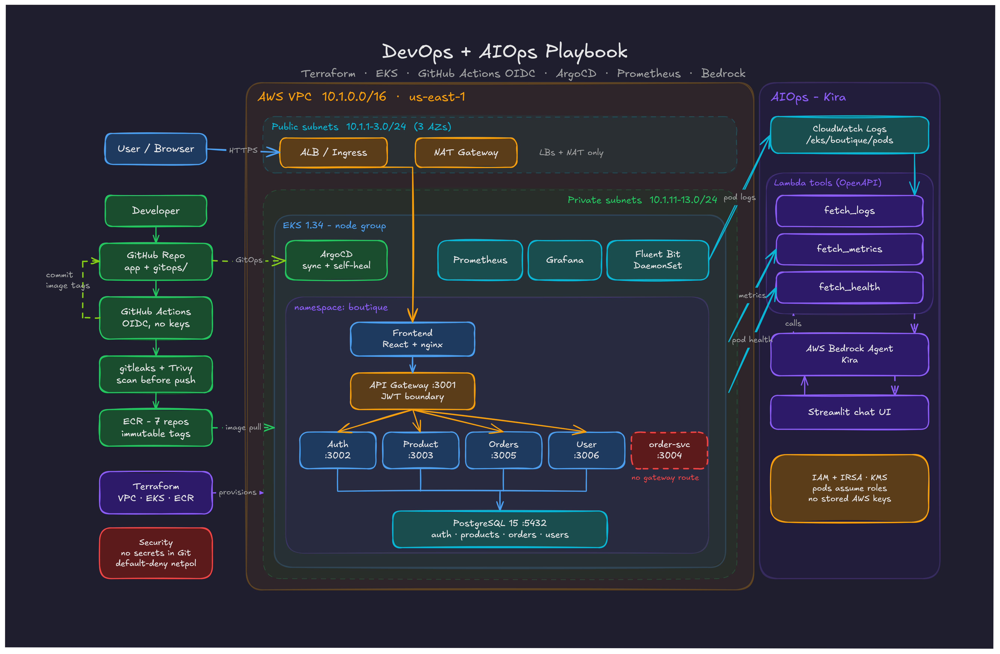

<p align="center">
  <h1 align="center">🚀 DevOps + AIOps Playbook</h1>
  <p align="center">
    An end-to-end DevOps project with AIOps integration — from local development to production on AWS EKS, with CI/CD, GitOps, observability, and an AI-powered SRE assistant.
  </p>
</p>

<p align="center">
  
  
  
  
  
  
  
  
  
  
  
  
</p>

---

<p align="center">
  
</p>

---

## 🎯 What This Is

A production-style DevOps project that demonstrates how modern systems are designed, deployed, and operated — with AI-powered operations built in.

- A **7-service e-commerce microservices app** (React + Node.js + PostgreSQL)
- **Containerised** with Docker, orchestrated on **Kubernetes (AWS EKS)**
- Infrastructure provisioned with **Terraform** — VPC (public + private subnets), EKS, ECR, ArgoCD, monitoring
- **CI/CD** with GitHub Actions using **OIDC** — no long-lived AWS keys
- **GitOps** with ArgoCD — auto-sync from Git to the cluster
- **Observability** with Prometheus + Grafana
- **AIOps assistant (Kira)** — a Bedrock agent that diagnoses production incidents

> **Everything below is collapsible.** Click any section to expand it.

### 🏃 I just want to run it

| Goal | Section |
|------|---------|
| Run on my laptop (no AWS, no cost) | [▶ Run Locally](#-run-locally-docker) |
| Deploy to AWS | [▶ Deploy to AWS](#-deploy-to-aws-terraform--eks) |
| Shut it all down | [▶ Teardown](#-teardown--stop-billing) |
| Understand *why* each tool exists | [▶ Concept Guide](#-the-complete-concept-guide) |

---

## 💻 Run Locally (Docker)

<details>
<summary><b>Click to expand — full local runbook</b></summary>

<br />

Everything runs on your machine. **No AWS account, no cost.**

### Prerequisites

- [Docker Desktop](https://www.docker.com/products/docker-desktop/) — installed **and running**
- [Git](https://git-scm.com/downloads)

That's it. Node.js is only needed if you want to run services outside Docker.

---

### Step 1 — Clone

```bash
git clone https://github.com/jimilprabtani/DevOps-Project-02.git
cd DevOps-Project-02
```

### Step 2 — Create your `.env`

**Every credential comes from `.env`. There are no default passwords anywhere** — services refuse to start without it, by design.

**Windows (PowerShell):**
```powershell
./scripts/setup-local-env.ps1
```

This generates strong random secrets using the OS cryptographic RNG and writes `projects/boutique-microservices/.env`. It prints your Grafana password — save it. Re-run with `-Force` to regenerate.

**macOS / Linux:**
```bash
cd projects/boutique-microservices
cp .env.example .env

# Generate three DIFFERENT secrets and paste them into .env
openssl rand -base64 48   # → POSTGRES_PASSWORD
openssl rand -base64 48   # → JWT_ACCESS_SECRET
openssl rand -base64 48   # → JWT_REFRESH_SECRET
```

> ⚠️ `JWT_ACCESS_SECRET` and `JWT_REFRESH_SECRET` **must differ**. Reusing one lets a long-lived refresh token be replayed as an access token. The services validate this on boot and refuse to start if they match.

### Step 3 — Start everything

```bash
cd projects/boutique-microservices

# Wipe any old database volume (see the warning below)
docker compose down -v

# Build all 7 images and start the stack
docker compose up -d --build
```

First build takes **3–5 minutes**. Subsequent starts are seconds.

> ### ⚠️ Why `down -v` matters
> Postgres **only runs its init scripts when the data volume is empty**. If you ran this project before, you have an old volume with an outdated schema, and the new tables (`refresh_tokens`, `payment_status`, the whole `users_db`) will not be created — you would get HTTP 500 on login. `-v` deletes the volume so the scripts re-run.

### Step 4 — Verify

```bash
docker compose ps                 # all "running"; postgres "healthy"
docker compose logs -f auth       # watch a service boot
docker compose logs postgres | Select-String "database system is ready"
```

Health checks:
```bash
curl http://localhost:3001/healthz     # gateway  → {"status":"ok"}
curl http://localhost:3000/healthz     # frontend → {"status":"ok"}
```

### Step 5 — Open the site

| URL | What |
|-----|------|
| **http://localhost:3000** | ☀️ Sunfreaks landing page |
| http://localhost:3000/shop | The store |
| http://localhost:3000/products | Product catalogue |
| http://localhost:3000/register | Create an account |
| http://localhost:3007 | Grafana (`admin` / password from Step 2) |
| http://localhost:9090 | Prometheus |
| http://localhost:3001/metrics | Gateway metrics |

**Create an account at `/register`** — passwords must be **12+ characters**. There are no seed accounts; the old demo logins were removed because their password hash was an invalid placeholder that could never authenticate.

> Backend services (auth, orders, products, users) deliberately publish **no host ports**. They are reachable only through the gateway. Postgres binds to `127.0.0.1` only.

---

### Everyday commands

```bash
docker compose ps                      # status
docker compose logs -f <service>       # follow logs
docker compose restart <service>       # restart one service
docker compose down                    # stop, KEEP data
docker compose down -v                 # stop, DELETE data (full reset)
docker compose up -d --build <service> # rebuild one service
```

**After changing backend code:**
```bash
docker compose up -d --build auth      # or whichever service
```

**After changing frontend code:**
```bash
cd frontend && npm install && npm run build && cd ..
docker compose restart frontend
```
The frontend container serves `./frontend/build` from a volume mount, so a rebuild + restart is enough — no image rebuild needed.

**Connect to the database:**
```bash
docker compose exec postgres psql -U boutique_app -d auth_db
# \dt to list tables, \q to quit
```

---

### Local troubleshooting

| Symptom | Cause | Fix |
|---|---|---|
| `error while creating mount source` / daemon errors | Docker Desktop not running | Start Docker Desktop, wait for the whale icon to settle |
| `required variable POSTGRES_PASSWORD is missing` | No `.env` | Run Step 2 |
| `JWT_ACCESS_SECRET must be at least 32 characters` | Placeholder still in `.env` | Regenerate: `./scripts/setup-local-env.ps1 -Force` |
| `JWT_ACCESS_SECRET and JWT_REFRESH_SECRET must be different` | Same value pasted twice | Generate two distinct secrets |
| 500 on login/register | Old DB volume, missing `refresh_tokens` | `docker compose down -v && docker compose up -d` |
| `relation "payment_status" does not exist` | Old DB volume | Same as above |
| Port 3000 already in use | Another app owns it | Stop it, or change the mapping in `docker-compose.yml` |
| Blank page at localhost:3000 | Frontend never built | `cd frontend && npm install && npm run build` |
| `429 Too Many Requests` on login | Rate limiter (5 failures / 15 min) | Wait, or raise `AUTH_RATE_LIMIT_MAX` in `.env` |

---

### Known limitations (local and cloud)

- **`/profile` returns 404 for newly registered accounts.** Registration writes to `auth_db.users`, but the user-service reads `users_db.users`, and nothing synchronises them. This is a pre-existing data-model split — fixing it properly means one shared user store or a registration event.
- **The waitlist form on the landing page does not submit anywhere.** No backend route exists; it validates client-side only and is marked `TODO` in the code.
- **`order-service` (port 3004) is unreachable.** The gateway reads `ORDERS_SERVICE_URL`, never `ORDER_SERVICE_URL`, so this service runs but receives no traffic. It duplicates `orders` and needs a product decision.

</details>

---

## ☁️ Deploy to AWS (Terraform + EKS)

<details>
<summary><b>Click to expand — full cloud runbook</b></summary>

<br />

> ### 💸 This costs real money
> EKS control plane ~$73/month, plus one `m7i-flex.large` node (~$60/month), plus a NAT gateway (~$32/month) and EBS volumes. **Budget roughly $170/month if left running.** Follow [Teardown](#-teardown--stop-billing) when finished.

> ### ⚠️ Order matters
> ArgoCD deploys whatever image tag is in Git. If the images aren't in ECR **yet**, pods fail with `ImagePullBackOff`. The golden rule: **build images (CI) → *then* let ArgoCD deploy.**

---

### Prerequisites

- [AWS CLI v2](https://docs.aws.amazon.com/cli/latest/userguide/install-cliv2.html), configured — verify with `aws sts get-caller-identity`
- [Terraform](https://developer.hashicorp.com/terraform/install) ≥ 1.5
- [kubectl](https://kubernetes.io/docs/tasks/tools/)
- A GitHub fork of this repo (CI pushes commits back to it)

---

### Step 0 — One-time: GitHub OIDC role

CI uses **short-lived OIDC credentials**, not permanent AWS keys. Create an IAM role that trusts GitHub's OIDC provider:

```json
{
  "Version": "2012-10-17",
  "Statement": [{
    "Effect": "Allow",
    "Principal": {
      "Federated": "arn:aws:iam::<ACCOUNT_ID>:oidc-provider/token.actions.githubusercontent.com"
    },
    "Action": "sts:AssumeRoleWithWebIdentity",
    "Condition": {
      "StringEquals": {
        "token.actions.githubusercontent.com:aud": "sts.amazonaws.com"
      },
      "StringLike": {
        "token.actions.githubusercontent.com:sub": "repo:<YOUR_GH_USER>/<YOUR_REPO>:*"
      }
    }
  }]
}
```

Attach permissions for ECR push, then in your repo → **Settings → Secrets and variables → Actions**:

| Secret | Value |
|--------|-------|
| `AWS_ROLE_ARN` | `arn:aws:iam::<ACCOUNT_ID>:role/<role-name>` |

Set repository **variable** `AWS_REGION` to `us-east-1`.

> 🔴 **Delete `AWS_ACCESS_KEY_ID` and `AWS_SECRET_ACCESS_KEY` if they exist.** Long-lived keys never expire and grant standing account access to anyone who can run a workflow.

---

### Step 1 — Configure Terraform variables

```bash
cd projects/Infrastructure
cp terraform.tfvars.example terraform.tfvars
```

**You must set your own IP.** Terraform has a validation rule that *rejects* `0.0.0.0/0`, so `plan` fails until you do:

```bash
curl -s https://checkip.amazonaws.com
```

Then edit `terraform.tfvars`:
```hcl
public_access_cidrs = ["203.0.113.42/32"]   # ← your IP
```

> `terraform.tfvars` is gitignored because it contains your home IP address.

**Optional cost controls:**
```hcl
enable_nat_gateway = true    # false saves ~$32/mo but private nodes can't pull images
single_nat_gateway = true    # one NAT for all AZs (cheaper) vs one per AZ (resilient)
enable_flow_logs   = true
```

### Step 2 — Provision infrastructure

Creates the VPC (3 public + 3 private subnets, NAT, flow logs), EKS cluster with a private-subnet node group, KMS key for Secret encryption, 7 empty ECR repos, ArgoCD, and Prometheus/Grafana.

```bash
terraform init
terraform plan        # review carefully
terraform apply       # type: yes    (~15–20 min)
```

### Step 3 — Point kubectl at the cluster

> This fixes `dial tcp [::1]:8080: connection refused` — that error just means kubectl has no cluster configured.

```bash
aws eks update-kubeconfig --region us-east-1 --name eks-cluster
kubectl get nodes     # should show 1 node, Ready
```

### Step 4 — Create the Kubernetes Secret

**Secrets are deliberately not in Git**, so ArgoCD cannot create this for you.

```bash
cd ../..                          # back to repo root
./scripts/bootstrap-secrets.sh
```

The script reads `projects/boutique-microservices/.env`, **validates** it (rejects `CHANGE_ME` placeholders, enforces minimum lengths, rejects identical JWT secrets), and applies the Secret with an annotation that stops ArgoCD from pruning it.

> If you skipped the local setup, create `.env` first — see [Run Locally, Step 2](#-run-locally-docker).

### Step 5 — Build & push images (CI) — **BEFORE deploying**

The ECR repos are empty right after `terraform apply`.

1. GitHub → **Actions** → **Boutique CI Pipeline** → **Run workflow**
2. The pipeline runs gitleaks + Trivy scans, builds all 7 images, scans them **before** pushing, pushes to ECR tagged with the commit SHA, then commits the updated tags back to `gitops/k8s/`

Pull that auto-commit:
```bash
git pull
```

### Step 6 — Deploy via ArgoCD (GitOps)

```bash
kubectl apply -f gitops/argo-cd.yml
```

Auto-sync and self-heal are enabled — no manual sync needed. Watch it:

```bash
kubectl get pods -n boutique -w
kubectl wait --for=condition=available deployment --all -n boutique --timeout=300s
```

### Step 7 — Load the database schema

```bash
kubectl apply -f gitops/k8s/database/restore-job.yml
kubectl logs -n boutique -l job-name=boutique-db-restore -f
```

### Step 8 — Access everything

```bash
kubectl port-forward svc/frontend 3000:3000 -n boutique &
kubectl port-forward svc/gateway 3001:3001 -n boutique &
kubectl port-forward svc/kube-prometheus-stack-prometheus 9090:9090 -n monitoring &
kubectl port-forward svc/kube-prometheus-stack-grafana 8080:80 -n monitoring &
kubectl port-forward svc/argocd-server 8443:443 -n argocd &
```

| Service | URL |
|---------|-----|
| ☀️ Frontend | http://localhost:3000 |
| 🔗 Gateway metrics | http://localhost:3001/metrics |
| 📈 Prometheus | http://localhost:9090 |
| 📊 Grafana | http://localhost:8080 |
| 🔄 ArgoCD UI | https://localhost:8443 |

**Grafana password:**
```bash
kubectl get secret kube-prometheus-stack-grafana -n monitoring \
  -o jsonpath="{.data.admin-password}" | base64 --decode
```

**ArgoCD password** (username `admin`):
```bash
kubectl -n argocd get secret argocd-initial-admin-secret \
  -o jsonpath="{.data.password}" | base64 -d
```

> ArgoCD now runs **with TLS enabled** (`server.insecure = false`). Use `https://localhost:8443` and accept the self-signed certificate warning.

### Step 9 — Optional: log forwarding to CloudWatch

Required if you want the AIOps assistant to read real logs.

```bash
helm repo add aws https://aws.github.io/eks-charts
helm repo update

helm upgrade --install aws-for-fluent-bit aws/aws-for-fluent-bit \
  --namespace amazon-cloudwatch --create-namespace \
  --set cloudWatch.enabled=true \
  --set cloudWatch.region=us-east-1 \
  --set cloudWatch.logGroupName=/eks/boutique/pods \
  --set cloudWatch.logStreamPrefix=from-fluent-bit- \
  --set firehose.enabled=false --set kinesis.enabled=false \
  --set elasticsearch.enabled=false
```

---

### Redeploy after a code change

```bash
git push origin main
# Run the Boutique CI Pipeline in GitHub Actions
# ArgoCD auto-syncs → zero-downtime rolling update
```

**Manual deploy without ArgoCD:**
```bash
kubectl apply -k gitops/
kubectl get pods -n boutique
```

---

### Cloud troubleshooting

| Symptom | Root cause | Fix |
|---|---|---|
| `dial tcp [::1]:8080: connection refused` | kubectl has no cluster | `aws eks update-kubeconfig --region us-east-1 --name eks-cluster` |
| `public_access_cidrs must not contain 0.0.0.0/0` | Validation rule firing (working as intended) | Set your real IP in `terraform.tfvars` |
| Pods `CreateContainerConfigError` | `boutique-secrets` missing | Run `./scripts/bootstrap-secrets.sh` |
| Pods `ImagePullBackOff` / `ErrImagePull` | Image tag in Git isn't in ECR | Run CI **before** deploying, then `git pull` |
| Pods `InvalidImageName` | Unfilled `<AWS_ACCOUNT_ID>` placeholder | CI's `update-manifests` job fills these |
| Pod `CrashLoopBackOff`, logs show `[config] Required environment variable...` | Secret missing a key | Re-run `bootstrap-secrets.sh` after fixing `.env` |
| NetworkPolicies not enforced | VPC CNI network policy disabled | Terraform sets `enableNetworkPolicy=true`; verify the `vpc-cni` addon applied |
| App stuck `OutOfSync` | Cluster drifted from Git | Self-heal corrects it; or click **Sync** |
| `terraform destroy` hangs on VPC | LoadBalancer/PVC created untracked AWS resources | Delete the `boutique` namespace first |
| `too many pods` on node | Instance pod limit hit | Larger instance type — see [Issues.md](projects/Issues.md) |

</details>

---

## 💣 Teardown — Stop Billing

<details>
<summary><b>Click to expand — delete everything</b></summary>

<br />

> **Order matters:** delete the app first so Kubernetes releases the EBS volumes. Otherwise `terraform destroy` leaves orphaned, still-billing resources.

```bash
# 1. Delete the application namespace (releases EBS volumes)
kubectl delete namespace boutique

# 2. Confirm the volumes are gone (should print nothing)
aws ec2 describe-volumes --region us-east-1 \
  --filters "Name=tag:kubernetes.io/cluster/eks-cluster,Values=owned" \
  --query 'Volumes[].VolumeId' --output text

# 3. Destroy all infrastructure
cd projects/Infrastructure
terraform destroy      # type: yes   (~15 min)
```

### Verify nothing is left billing

```bash
aws eks list-clusters --region us-east-1
aws ec2 describe-instances --region us-east-1 \
  --filters "Name=instance-state-name,Values=running" \
  --query 'Reservations[].Instances[].InstanceId'
aws elbv2 describe-load-balancers --region us-east-1 --query 'LoadBalancers[].LoadBalancerName'
aws ec2 describe-volumes --region us-east-1 --query 'Volumes[].VolumeId'
aws ecr describe-repositories --region us-east-1 --query 'repositories[].repositoryName'

# NAT gateways and Elastic IPs bill separately — check these too
aws ec2 describe-nat-gateways --region us-east-1 \
  --filter "Name=state,Values=available" --query 'NatGateways[].NatGatewayId'
aws ec2 describe-addresses --region us-east-1 --query 'Addresses[].AllocationId'
```

All should be empty.

**Local teardown:**
```bash
cd projects/boutique-microservices
docker compose down -v          # also deletes data volumes
docker system prune -a          # optional: reclaim image disk space
```

</details>

---

## 🏗 Architecture

<details>
<summary><b>Click to expand — diagrams, ports, and request flow</b></summary>

<br />

### Application architecture

```
                            ┌─────────────┐
                            │   Frontend  │  nginx :8080 (→ :3000 host)
                            └──────┬──────┘
                                   │  /api/* proxied
                            ┌──────▼──────┐
                            │   Gateway   │  :3001  ← JWT verified HERE
                            └──────┬──────┘
        ┌──────────────────────────┼──────────────────────────┐
        │                          │                          │
 ┌──────▼──────┐         ┌─────────▼───────┐        ┌─────────▼──────┐
 │    Auth     │         │ Product Service │        │  User Service  │
 │    :3002    │         │      :3003      │        │     :3006      │
 └──────┬──────┘         └────────┬────────┘        └────────┬───────┘
        │                         │                          │
 ┌──────▼──────┐          ┌───────▼───────┐                  │
 │Order Service│          │    Orders     │                  │
 │    :3004    │          │     :3005     │                  │
 │ (orphaned)  │          └───────┬───────┘                  │
 └──────┬──────┘                  │                          │
        └─────────────────────────┴──────────────────────────┘
                                   │
                            ┌──────▼──────┐
                            │  PostgreSQL │  :5432
                            └─────────────┘
                      auth_db · products_db · orders_db · users_db
```

### Request flow (authenticated)

```
Browser
  │  Authorization: Bearer <15-min access token>
  ▼
nginx  ── strips any client-supplied X-User-* headers
  ▼
Gateway
  │  1. strips X-User-* again (defence in depth)
  │  2. verifies JWT signature, issuer, audience, algorithm (HS256 pinned)
  │  3. sets trusted X-User-Id / X-User-Email / X-User-Role
  ▼
Backend service
  │  re-verifies the JWT independently — never trusts headers alone
  ▼
PostgreSQL (parameterised queries only)
```

### DevOps pipeline

```
Developer → git push → GitHub Actions (OIDC) → gitleaks + Trivy scan
                                             → build 7 images
                                             → Trivy scan images PRE-push
                                             → push to ECR (immutable tags)
                                             → commit new tags to gitops/k8s/
                                                        │
                                             ArgoCD (auto-sync + self-heal)
                                                        │
                                                   EKS Cluster
                                                        │
                                   Prometheus + Grafana ─┴─ CloudWatch Logs
                                                             │
                                                       Kira (AIOps Agent)
```

### Service reference

| Service | Port | Role | Host port? |
|---------|------|------|-----------|
| Frontend | 8080 | React UI + nginx reverse proxy | ✅ 3000 |
| Gateway | 3001 | Auth boundary; routes all client requests | ✅ 3001 |
| Auth | 3002 | Registration, login, JWT issuance, refresh | ❌ internal |
| Product Service | 3003 | Product catalogue | ❌ internal |
| Order Service | 3004 | ⚠️ orphaned — unreachable via gateway | ❌ internal |
| Orders | 3005 | Order creation and history | ❌ internal |
| User Service | 3006 | Profiles and addresses | ❌ internal |
| PostgreSQL | 5432 | 4 databases | 🔒 127.0.0.1 only |
| Prometheus | 9090 | Metrics | 🔒 127.0.0.1 only |
| Grafana | 3000→3007 | Dashboards | 🔒 127.0.0.1 only |

### AWS network topology

```
VPC 10.1.0.0/16
├── Public subnets  10.1.1.0/24, 10.1.2.0/24, 10.1.3.0/24   (3 AZs)
│   └── Load balancers + NAT gateway ONLY
└── Private subnets 10.1.11.0/24, 10.1.12.0/24, 10.1.13.0/24 (3 AZs)
    └── EKS worker nodes — no public IPs
```

</details>

---

## 📁 Repository Structure

<details>
<summary><b>Click to expand</b></summary>

<br />

```
devops-ai-playbook/
│
├── README.md                            # 📖 You are here — the unified guide
├── SECURITY-REMEDIATION.md              # 🔒 Full security audit + fix report
├── CLAUDE.md                            # 🤖 Claude Code project instructions (functional file)
│
├── scripts/
│   ├── setup-local-env.ps1              #    Generate .env with strong secrets (Windows)
│   └── bootstrap-secrets.sh             #    Create the K8s Secret from .env
│
├── docs/
│   ├── part1-system-design.md
│   ├── part1-beginner-concepts.md
│   ├── part2-workflow.md
│   └── claude-setup.md                  #    Claude Code + MCP server setup
│
├── projects/
│   ├── boutique-microservices/          #    The application
│   │   ├── .env.example                 #      Environment template (copy to .env)
│   │   ├── docker-compose.yml           #      Local stack
│   │   ├── frontend/                    #      React + TypeScript
│   │   │   └── src/
│   │   │       ├── pages/Landing/       #        ☀️ Sunfreaks landing page
│   │   │       ├── styles/sunfreaks.css #        Design system tokens
│   │   │       ├── theme.ts             #        MUI theme (store)
│   │   │       └── services/tokenStore.ts #      In-memory token (never localStorage)
│   │   ├── backend/
│   │   │   ├── SHARED-CODE.md           #      Why security code is duplicated
│   │   │   └── services/                #      6 Node.js microservices
│   │   │       └── <service>/src/
│   │   │           ├── config/env.ts    #        Fail-fast env validation
│   │   │           ├── middleware/auth.ts #      JWT verification
│   │   │           └── security/        #        Token signing, validation
│   │   └── database/init/               #      Local schema bootstrap
│   │
│   ├── Infrastructure/                  #    Terraform
│   │   ├── main.tf                      #      Wires VPC, EKS, ECR, ArgoCD
│   │   ├── terraform.tfvars.example     #      Copy to terraform.tfvars
│   │   └── modules/{vpc,eks,ecr,argocd}/
│   │
│   └── aiops-assistant/                 #    Kira — Bedrock agent
│       ├── app.py                       #      Streamlit chat UI
│       ├── lambda/{fetch_logs,fetch_metrics,fetch_health}/
│       └── schemas/                     #      OpenAPI tool definitions
│
├── gitops/                              # 🔄 ArgoCD watches this folder
│   ├── argo-cd.yml                      #    Application definition
│   ├── kustomization.yml                #    Resource index
│   ├── network-policies.yml             #    Default-deny + least privilege
│   ├── secrets.example.yml              #    Template ONLY (no real values)
│   └── k8s/{backend,frontend,database}/
│
└── .github/workflows/ci.yml             # ⚙️ OIDC + scanning + build + push
```

</details>

---

## 🧰 Tech Stack

<details>
<summary><b>Click to expand</b></summary>

<br />

| Layer | Technology | Purpose |
|-------|-----------|---------|
| **Frontend** | React 19 + TypeScript, MUI | Landing page + store UI |
| **Backend** | Node.js + Express + TypeScript | 6 microservices |
| **Auth** | jsonwebtoken (HS256), bcryptjs | Signed JWTs, revocable refresh tokens |
| **Database** | PostgreSQL 15 | 4 databases, parameterised queries |
| **Containers** | Docker, Docker Compose | Local dev + image builds |
| **Orchestration** | Kubernetes (AWS EKS 1.34) | Production runtime |
| **Infrastructure** | Terraform ≥ 1.5 | VPC, EKS, ECR, ArgoCD, monitoring |
| **CI/CD** | GitHub Actions + OIDC | Build, scan, push, update manifests |
| **Security scanning** | gitleaks, Trivy | Secrets, IaC, and image CVEs |
| **GitOps** | ArgoCD 7.x + Kustomize | Auto-sync, self-heal |
| **Monitoring** | Prometheus + Grafana | Metrics and dashboards |
| **Logs** | Fluent Bit → CloudWatch | Centralised log collection |
| **AIOps** | AWS Bedrock Agent (Kira) | AI incident diagnosis |

</details>

---

## 🔒 Security

<details>
<summary><b>Click to expand — what was fixed and what you still must do</b></summary>

<br />

This project underwent a full security audit. **28 issues were fixed** — 4 critical, 4 high, 14 medium, 6 low. The complete report, with before/after code for every finding, is in **[SECURITY-REMEDIATION.md](SECURITY-REMEDIATION.md)**.

### The four critical fixes

| | Was | Now |
|---|---|---|
| **C1** | `if (password === 'demo')` logged in as *any* email, creating the account if absent | Branch deleted entirely |
| **C2** | `token: user.id.toString()` — the token *was* the primary key; unexpirable, unrevocable | Signed JWTs, 15-min TTL, `jti` revocation, rotation, reuse detection |
| **C3** | Gateway proxied everything and enforced nothing | Real auth boundary + 3 layers of identity-header stripping |
| **C4** | `JWT_SECRET \|\| 'your-secret-key'` — and it was never set, so the literal string was the production signing key | Required, length-validated, fails on boot |

### Secrets policy

- **Nothing sensitive is in Git.** `gitops/secrets.yml` (which contained a live DB password) was deleted and untracked.
- All credentials come from `.env`, which is gitignored.
- Compose uses `${VAR:?message}` — a missing secret **aborts the stack** rather than falling back to a default.
- Every service validates its config on boot and refuses to start on missing, short, or placeholder secrets.

### 🔴 Action still required

1. **Rotate the leaked database password.** `postgres123` remains in Git history — deleting the file does not remove past commits:
   ```bash
   pip install git-filter-repo
   git filter-repo --path gitops/secrets.yml --invert-paths
   git push --force
   ```
2. **Set `public_access_cidrs`** in `terraform.tfvars` before applying.
3. **Delete `AWS_ACCESS_KEY_ID` / `AWS_SECRET_ACCESS_KEY`** from GitHub secrets once OIDC works.

</details>

---

## 📚 The Complete Concept Guide

<details>
<summary><b>Click to expand — why every tool in this project exists</b></summary>

<br />

The best way to understand this project is as a story where each tool exists to fix the pain caused by the step before it. This guide walks through that story, concept by concept, pointing at the actual files in this repo as it goes.

---

### Part 1 — The Application

<details>
<summary><b>1. Microservices (vs. Monolith)</b></summary>

<br />

A **monolith** is one big program that does everything — login, products, orders — in a single codebase and process. Simple to start, but painful to scale: if the orders feature crashes, the whole store goes down, and to update one line you redeploy everything.

**Microservices** split the app into small, independent programs that each do one job and talk over the network. This project has 7: frontend, gateway, auth, product-service, order-service, orders, user-service. If the product service crashes, the login page still works. Each lives in its own folder under `projects/boutique-microservices/backend/services/` with its own `package.json` — that independence is the whole point.

The trade-off: you gain resilience and independent deployment, but now you manage 7 things instead of 1. Most of the rest of this project exists to handle that burden.

</details>

<details>
<summary><b>2. The API Gateway</b></summary>

<br />

The React frontend could call all 6 backend services directly, but then it would need to know 6 addresses, and every request would need security handling in 6 places. Instead everything goes through **one front door**: the gateway (port 3001). It routes `/api/products` → product service, `/api/auth` → auth service.

Think of it as a hotel receptionist: guests don't wander into the kitchen; they ask the front desk, which knows where everything is.

**This is also the security boundary.** The gateway verifies the JWT once and passes a *trusted* identity downstream. It originally enforced nothing at all — see [Security](#-security).

</details>

<details>
<summary><b>3. The Database — PostgreSQL</b></summary>

<br />

PostgreSQL is a relational database — data in tables, like strict spreadsheets. This project runs one Postgres server hosting **4 separate databases** (`auth_db`, `products_db`, `orders_db`, `users_db`) — one per service. That's a microservices principle: services shouldn't reach into each other's data; each owns its own.

The catch: that separation is why `/profile` 404s for new accounts — the account lands in `auth_db` but the profile is read from `users_db`, and nothing syncs them. Real systems solve this with events; this one hasn't yet.

</details>

---

### Part 2 — Containers

<details>
<summary><b>4. Docker</b></summary>

<br />

The classic problem: "it works on my machine" — the app runs fine on your laptop but breaks on the server because Node versions or system libraries differ.

A **container** packages the app *together with* everything it needs — runtime, libraries, config — into one sealed **image** that runs identically anywhere. Like a shipping container: the port crane doesn't care if it holds bananas or TVs.

Each service has a `Dockerfile` — a recipe saying "start from a Node.js base, copy my code, install dependencies, run this." These use **multi-stage builds**: one stage compiles TypeScript, a second copies only the compiled output into a clean image, so build tools never ship to production.

</details>

<details>
<summary><b>5. Docker Compose</b></summary>

<br />

Running 8 containers by hand with the right ports and links would take 8 long commands. `docker-compose.yml` describes all of them in one file, so `docker compose up` starts the whole system.

Compose is great on one machine, but it can't manage containers across *many* machines. That's Kubernetes' job.

</details>

<details>
<summary><b>6. Container Registry — ECR</b></summary>

<br />

Images built on a laptop need to reach the cloud. A **registry** is like GitHub, but for Docker images — you `push` images up, servers `pull` them down. **ECR** is AWS's registry. Terraform creates 7 repositories, one per service, with **immutable tags** so a published image can never be silently swapped.

</details>

---

### Part 3 — Kubernetes

<details>
<summary><b>7. Why Kubernetes Exists</b></summary>

<br />

In production you run containers across multiple servers, and something must answer: *Which server has room? A container died — who restarts it? Traffic spiked — who starts more copies?*

Kubernetes is that someone — an **orchestrator**, like air traffic control for containers. You declare the *destination* ("2 copies of auth running at all times") and it continuously makes reality match. This **desired state** model is the single most important idea in Kubernetes.

</details>

<details>
<summary><b>8. The Kubernetes Building Blocks</b></summary>

<br />

All in `gitops/k8s/`:

- **Pod** — the smallest unit; a wrapper around your container. Pods are disposable — they die, get replaced, and their IP changes every time.
- **Deployment** — the manager: "keep 2 identical auth pods alive using this image." Pod dies → replaced. New image → **rolling update** (start new, then kill old, so users see no downtime).
- **Service** — a stable address. Since pod IPs change constantly, a Service gives a fixed name (`boutique-postgres:5432`) and load-balances across whatever pods exist. The phone number that stays the same when the person moves house.
- **StatefulSet** — a Deployment for things that must *remember*, like databases. Regular pods are amnesiacs; a StatefulSet gives Postgres a stable identity and a persistent disk.
- **Namespace** — a folder inside the cluster. App in `boutique`, monitoring in `monitoring`, ArgoCD in `argocd` — so they don't collide and you can delete one group cleanly (exactly why teardown starts with `kubectl delete namespace boutique`).
- **ConfigMap / Secret** — settings injected into pods instead of baked into images. ConfigMaps for normal config, Secrets for passwords.
- **NetworkPolicy** — a firewall between pods. This project uses **default-deny**: nothing talks to anything unless explicitly allowed. Without it, any compromised pod could open a connection straight to Postgres.
- **Job** — a pod that runs once and exits. `restore-job.yml` loads the SQL schema and stops.
- **kubectl** — the remote control. `kubectl port-forward` creates a temporary encrypted tunnel from your laptop to a Service inside the cluster — that's how you open the store at localhost:3000 without exposing it to the internet.

</details>

<details>
<summary><b>9. EKS — Managed Kubernetes</b></summary>

<br />

Running Kubernetes' "brain" (the control plane) is hard: databases, certificates, upgrades. **EKS** means AWS runs the brain (~$73/month) and you manage only the **worker nodes** — the EC2 machines your pods run on.

From this repo's own [Issues.md](projects/Issues.md): each instance type has a hard pod limit (t3.medium = 17 pods) because pods consume network addresses — which is why the instance type had to be upgraded.

</details>

---

### Part 4 — Cloud Infrastructure

<details>
<summary><b>10. VPC and Subnets</b></summary>

<br />

A **VPC** is your own private, fenced-off section of AWS's network — like renting a floor in an office building. **Subnets** are rooms on that floor. A **public subnet** has a route to the internet; a **private subnet** doesn't.

This VPC has 3 public and 3 private subnets across 3 **availability zones** (physically separate data centres), so one data centre failing doesn't take everything down.

> **Updated:** this project originally placed worker nodes in *public* subnets with public IPs — meaning the machine running your database was directly internet-addressable. Nodes now run in **private** subnets and reach the internet through a **NAT gateway**, which allows outbound traffic (pulling images) while blocking all inbound.

</details>

<details>
<summary><b>11. Terraform — Infrastructure as Code</b></summary>

<br />

You *could* build the VPC and cluster by clicking through the AWS console. But clicks aren't repeatable, reviewable, or undoable. **IaC** means describing infrastructure in text files so it can be version-controlled, reviewed, recreated identically, and destroyed cleanly.

Three commands: `terraform plan` ("here's what I *would* change"), `terraform apply` ("do it"), `terraform destroy` ("delete it all"). Like Kubernetes, it's **declarative**.

Key ideas in `projects/Infrastructure/`:

- **Modules** — reusable folders of Terraform, like functions. `main.tf` is short because it just wires together `vpc`, `eks`, `ecr`, and `argocd`.
- **State file** (`terraform.tfstate`) — Terraform's memory of what it built and the real-world IDs. Lose it and Terraform forgets it owns your (still-billing!) infrastructure. It also contains secrets in plaintext, which is why the pro move is an encrypted S3 backend, not a laptop.
- **Variables** — the knobs (instance type, cluster name), kept separate from logic.
- **Validation** — `public_access_cidrs` has a rule *rejecting* `0.0.0.0/0`, so `plan` fails rather than silently exposing the cluster.

</details>

---

### Part 5 — Automation

<details>
<summary><b>12. CI/CD — GitHub Actions</b></summary>

<br />

**CI**: every change is automatically built and tested, so broken code is caught immediately. **CD**: getting it to production is automated too.

The robot lives in `.github/workflows/ci.yml`. It builds all 7 images using a **matrix strategy** (the same steps run 7 times in parallel), scans them, and pushes to ECR.

> **Updated:** credentials were originally permanent AWS access keys in GitHub Secrets — they never expire and grant standing account access to anyone who can run a workflow. The pipeline now uses **OIDC**: GitHub proves its identity to AWS per-run and receives credentials valid for about an hour. There is no permanent key to steal.

</details>

<details>
<summary><b>13. Image Tagging with the Commit SHA</b></summary>

<br />

Every image is tagged with the git commit hash (`auth:f712350...`) instead of `latest`. `latest` is a moving target — you can never be sure what's running. A SHA tag is traceable: see a pod running `auth:f712350` and you know *exactly* which code it contains.

Combined with **immutable** ECR tags, that guarantee actually holds — with mutable tags, someone could push different content under the same SHA.

</details>

<details>
<summary><b>14. GitOps — ArgoCD</b></summary>

<br />

Traditional deployment: a human runs `kubectl apply` and *pushes* to the cluster. Over time nobody's sure what's deployed, and manual hotfixes drift from Git.

**GitOps flips it**: the Git repo *is* the source of truth, and an agent inside the cluster — **ArgoCD** — continuously *pulls* from Git and makes the cluster match.

The full loop: **push code → CI builds images and updates the image tag in `gitops/k8s/` (a Git commit!) → ArgoCD notices → cluster updates itself.** Nobody runs `kubectl apply` for deployments.

- **Auto-sync**: apply Git changes automatically.
- **Self-heal**: manual cluster fiddling gets reverted to match Git. Drift becomes impossible — which is also a *security* property.

**Kustomize** (`kustomization.yml`) is the index card listing which YAML files make up the app.

> **The GitOps secrets tension:** ArgoCD needs manifests in Git, but secrets must *not* be in Git. This project resolves it by creating the Secret out-of-band (`scripts/bootstrap-secrets.sh`) and annotating it so ArgoCD won't prune it.

</details>

---

### Part 6 — Observability

<details>
<summary><b>15. Metrics — Prometheus</b></summary>

<br />

Once the app runs in the cloud you're blind without instruments. **Metrics** are numbers over time: requests per second, error counts, memory usage. Each service exposes a `/metrics` page, and **Prometheus** visits ("**scrapes**") every service on a schedule and stores the history.

This is *pull-based*: Prometheus fetches from apps; apps don't send. The **ServiceMonitor** is the note telling Prometheus "these services exist, scrape them at `/metrics`" — [Issues.md](projects/Issues.md) documents how getting its labels wrong meant no data at all.

</details>

<details>
<summary><b>16. Dashboards — Grafana</b></summary>

<br />

Prometheus stores numbers but is ugly to read. **Grafana** turns them into graphs — request rates, p95 latency ("95% of requests finish faster than this" — far more honest than an average), error rates, restarts. The dashboard auto-loads via a ConfigMap: dashboards as code, same philosophy as everything else.

</details>

<details>
<summary><b>17. Logs — Fluent Bit → CloudWatch</b></summary>

<br />

Metrics say *something is wrong*; **logs** say *what happened*. But pod logs vanish when pods die. **Fluent Bit** is a small agent on every node that ships all pod logs to **CloudWatch**, so they survive and are searchable in one place. This matters for the next part.

</details>

---

### Part 7 — AIOps and Security

<details>
<summary><b>18. Kira — the Bedrock Agent</b></summary>

<br />

**AIOps** = using AI to help operate systems. Kira is an **AI agent**: an LLM (via **AWS Bedrock**) given *tools* it can call. Her three tools are **Lambda functions** — code AWS runs on demand, no server needed: `fetch_logs` (CloudWatch), `fetch_metrics` (Prometheus), `fetch_health` (pods).

Ask "why are we seeing 503 errors?" and the model *decides for itself* which tools to call, reads real production data, and reasons to an answer. The `schemas/` folder holds the tool "menus" (OpenAPI) describing what each Lambda accepts. The chat window is a **Streamlit** app. This is the same tool-calling pattern that powers coding agents like Claude Code.

</details>

<details>
<summary><b>19. IAM and IRSA — Who's Allowed to Do What</b></summary>

<br />

**IAM** is AWS's permission system: every action needs an identity with a policy allowing it. **IRSA** (IAM Roles for Service Accounts) solves a subtle problem: a *pod* needing AWS permissions. Instead of stuffing AWS keys into the pod (dangerous), IRSA lets a specific Kubernetes service account *assume* an IAM role with exactly the permissions it needs — no stored keys.

The EBS storage driver uses this. The principle behind all of it: **least privilege** — everything gets the minimum permission needed, nothing more.

</details>

<details>
<summary><b>20. Secrets Management — This Repo's Teaching Moment</b></summary>

<br />

`gitops/secrets.yml` used to hold the database password in Git as plain text. The rule: **Git is forever** — deleting the file leaves the password in history.

**This has now been fixed**, and the fix is the lesson:

| Problem | Solution used here |
|---|---|
| Secret in Git | Deleted, untracked, gitignored |
| ArgoCD needs manifests in Git | Secret created out-of-band, annotated `Prune=false` |
| Silent fallback defaults | Services validate on boot and *refuse to start* |
| No rotation path | Documented `git filter-repo` history purge |

The industry solutions — **Sealed Secrets**, **External Secrets Operator**, **SOPS** — all boil down to: put an *encrypted* or *reference-only* version in Git and let something inside the cluster resolve the real value. `gitops/secrets.example.yml` documents both migration paths.

> **The password is still in this repo's Git history.** That's the whole point of the lesson: prevention is far cheaper than cleanup. See [Security](#-security) for the rotation steps.

</details>

---

### The One-Paragraph Summary

You wrote a store as 7 small services → Docker packs each into a portable box → ECR stores the boxes → Kubernetes (on EKS) runs and heals them across servers → Terraform builds all the AWS scaffolding from code → GitHub Actions automatically builds, scans, and tags new boxes on every change → ArgoCD watches Git and keeps the cluster matching it → Prometheus and Grafana show you it's healthy → Fluent Bit archives the logs → and Kira reads all of that to diagnose incidents in plain English. Every layer replaces a manual, error-prone human task with declared, version-controlled automation.

</details>

---

## 🤖 AI-Assisted Development (Claude Code)

<details>
<summary><b>Click to expand — project instructions and MCP setup</b></summary>

<br />

### Project instructions

The repo root contains **[`CLAUDE.md`](CLAUDE.md)**, which Claude Code loads automatically as project instructions. Its contents are mirrored here for visibility:

> **You are operating in safe execution mode.**
>
> Before executing any command:
> - Before taking any action, briefly explain what you're about to do in 1–2 simple sentences
> - Use plain language, avoid jargon
> - Say WHY, not just WHAT
> - Then proceed with the action
>
> Always prefer clear reasoning before action.

> ⚠️ **`CLAUDE.md` must stay a real file at the repo root.** Claude Code reads it from disk — this README section is a mirror for human readers, not a replacement. Edit `CLAUDE.md` to change the behaviour, then update this section to match.

### MCP servers

| MCP Server | Capability |
|------------|-----------|
| `awslabs.eks-mcp-server` | Query EKS clusters, inspect pods, stream logs, apply manifests |
| `awslabs.terraform-mcp-server` | Run Terraform commands, search provider docs, run Checkov scans |
| `awslabs.aws-pricing-mcp-server` | Live AWS pricing lookups and cost analysis |

Full setup: **[`docs/claude-setup.md`](docs/claude-setup.md)**

### Learning series

| Part | Topic | Document |
|------|-------|----------|
| Setup | Claude Code + MCP configuration | [`docs/claude-setup.md`](docs/claude-setup.md) |
| Part 1 | System design foundations — 12 pillars | [`docs/part1-system-design.md`](docs/part1-system-design.md) |
| Part 1b | Beginner-friendly concepts | [`docs/part1-beginner-concepts.md`](docs/part1-beginner-concepts.md) |
| Part 2 | Full workflow — developer to AIOps | [`docs/part2-workflow.md`](docs/part2-workflow.md) |
| Part 3 | Hands-on deployment | [`projects/README.md`](projects/README.md) |
| Part 4 | AIOps integration — Kira | [`projects/aiops-assistant/README.md`](projects/aiops-assistant/README.md) |

</details>

---

## 🤝 Contributing

<details>
<summary><b>Click to expand</b></summary>

<br />

1. Fork the repository
2. Create a feature branch (`git checkout -b feature/your-feature`)
3. Commit your changes
4. Push and open a Pull Request

**Before submitting:**
```bash
# Typecheck the services you touched
cd projects/boutique-microservices/backend/services/<service>
npx tsc --noEmit

# Build the frontend
cd projects/boutique-microservices/frontend && npm run build
```

Never commit `.env`, `terraform.tfvars`, `*.tfstate`, or any file containing a real credential.

</details>

---

## 📄 License

Open source and available for educational purposes.

---

<p align="center">
  <b>Built with ❤️ for the DevOps community</b>
  <br />
  <i>If this helped you learn, give it a ⭐ and share it!</i>
</p>
